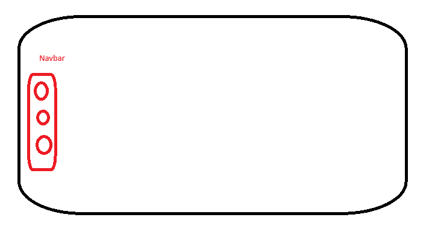

# Về trang chung này
Sẽ được thiết kế theo monoliths

## Phần 1 - Cấu trúc
Sẽ thiết kế theo dạng

## Phần 2 - Giao diện và màu sắc
Sẽ thiết kế theo các form giao diện bắt mắt, siêu đẹp - đồng thời phải tối ưu và hiểu từng flow

## Phần 3 - Dữ liệu
Tại trang này thì sẽ sử dụng three party (firebase) làm database lưu trữ dữ liệu 